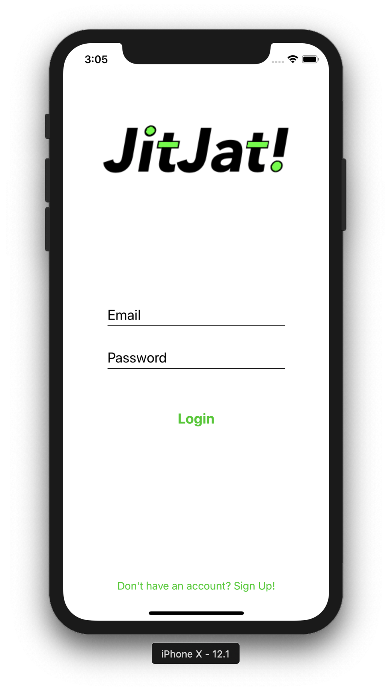
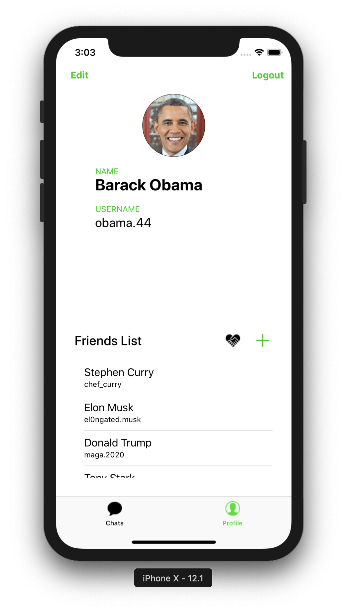
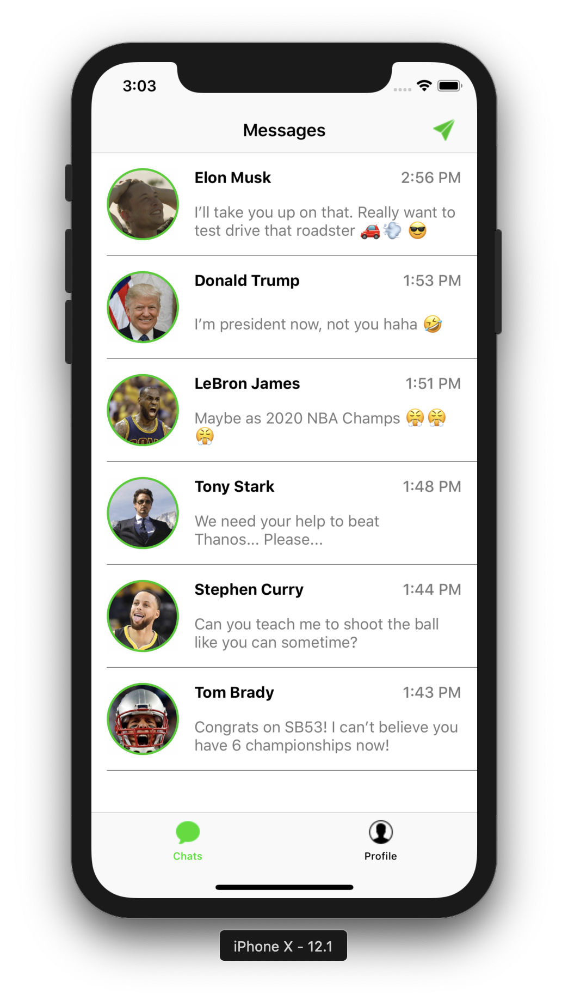
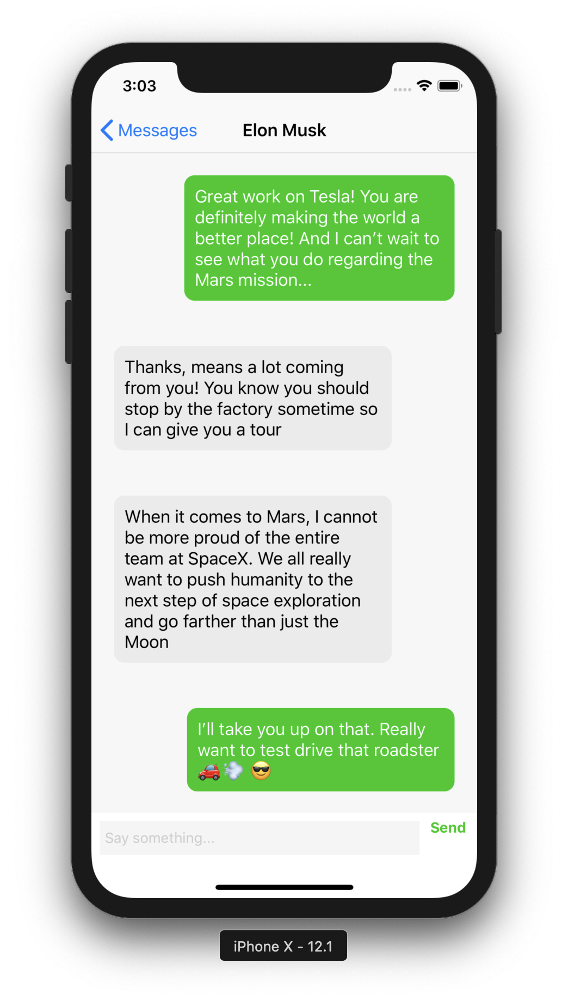

# JitJat

## Description
JitJat, inspired by the word "chit-chat", is an iOS-based messaging application. You can sign up, add friends, and chat with them about whatever you choose. I tried to make it look as minimal as possible & took some cues from other popular messaging services. This app was developed in Swift, uses Firebase to securely store messages, and implements various third-party libraries for some UI elements & background tasks. 

## Screenshots
   

&nbsp;&nbsp;&nbsp;&nbsp;&nbsp;&nbsp;&nbsp;&nbsp;&nbsp;&nbsp;&nbsp;&nbsp;&nbsp;&nbsp;Login Page&nbsp;&nbsp;&nbsp;&nbsp;&nbsp;&nbsp;&nbsp;&nbsp;&nbsp;&nbsp;&nbsp;&nbsp;&nbsp;&nbsp;&nbsp;&nbsp;&nbsp;&nbsp;&nbsp;&nbsp;&nbsp;&nbsp;&nbsp;&nbsp;&nbsp;&nbsp;&nbsp;&nbsp;&nbsp;Profile Page&nbsp;&nbsp;&nbsp;&nbsp;&nbsp;&nbsp;&nbsp;&nbsp;&nbsp;&nbsp;&nbsp;&nbsp;&nbsp;&nbsp;&nbsp;&nbsp;&nbsp;&nbsp;&nbsp;&nbsp;&nbsp;&nbsp;&nbsp;&nbsp;&nbsp;Conversations&nbsp;&nbsp;&nbsp;&nbsp;&nbsp;&nbsp;&nbsp;&nbsp;&nbsp;&nbsp;&nbsp;&nbsp;&nbsp;&nbsp;&nbsp;&nbsp;&nbsp;&nbsp;&nbsp;&nbsp;&nbsp;&nbsp;&nbsp;&nbsp;&nbsp;&nbsp;&nbsp;Chat View

## Future Plans
- Image & video support
- Group messaging
- Dark mode

## Attributions/Pods Used
- GrowingTextView: (https://github.com/KennethTsang/GrowingTextView)
- SDWebImage: (https://github.com/SDWebImage/SDWebImage)
- SkyFloatingLabelTextField: (https://github.com/Skyscanner/SkyFloatingLabelTextField)
- Toast-Swift: (https://github.com/scalessec/Toast-Swift)
